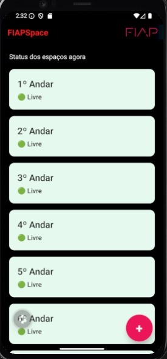
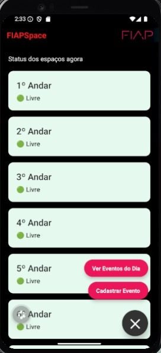
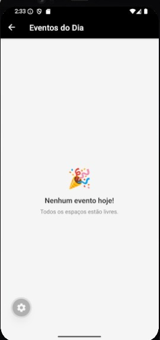
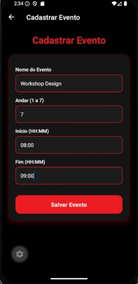
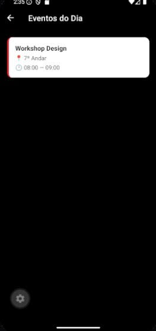

# FIAPSpace

## Sobre o Projeto

### Problema
A dificuldade de encontrar salas ou andares livres na FIAP para estudos ou reuniões rápidas gera perda de tempo e ineficiência na utilização dos espaços disponíveis.

### Solução
O FIAPSpace é um MVP funcional que permite monitorar em tempo real a ocupação dos andares com base em eventos cadastrados, facilitando a visualização de disponibilidade e a tomada de decisão pelos usuários.

---

## Funcionalidades

- Monitoramento em tempo real da ocupação dos andares
- Cadastro de eventos com validação de dados
- Suporte a 7 andares
- Listagem de eventos do dia
- Tratamento de estados vazios com feedback visual
- Menu interativo com Floating Action Button (FAB)

---

## Identidade Visual

O aplicativo utiliza um tema escuro (Premium Dark), com foco em contraste e legibilidade.

A cor principal utilizada é o vermelho institucional da FIAP (#ED1C24), aplicada principalmente no header e em elementos de destaque, garantindo alinhamento com a identidade visual da instituição.

---

## Decisões Técnicas

### Gerenciamento de Estado (Context API)
Foi utilizado o createContext no arquivo `_layout.js` para compartilhar a lista de eventos entre as telas. Essa abordagem permite que as informações sejam atualizadas em tempo real, garantindo consistência entre cadastro, listagem e status dos andares.

### Navegação (Expo Router)
A navegação foi estruturada utilizando Expo Router com Stack Navigation, organizando as seguintes telas:
- Home (status dos andares)
- Eventos (listagem)
- Cadastro (criação de eventos)

### UX e Navegação (FAB Expansível)
Foi implementado um Floating Action Button (FAB) na tela principal, controlado por estado (`useState`), que expande e apresenta opções de navegação. Essa decisão reduz poluição visual e melhora a usabilidade, especialmente considerando a rolagem dos 7 andares.

### Header Customizado
O header foi personalizado utilizando `headerTitle` do Expo Router, permitindo a inclusão de um componente com nome do aplicativo e logo, garantindo maior identidade visual.

---

## Tecnologias Utilizadas

- React Native
- Expo
- Expo Router
- JavaScript (ES6+)
- Context API

---

## Demonstração

### Telas do Aplicativo







### Vídeo de Demonstração

[Visualizar demonstração do sistema](https://youtube.com/shorts/kDjeqhYMaDA?feature=share)

---

## Como Rodar o Projeto

### Pré-requisitos

- Node.js
- npm ou yarn
- Expo Go (dispositivo móvel) ou emulador

### Execução

```bash
git clone https://github.com/Luisin07/fiapspace.git
cd fiapspace
npm install
npx expo start

### Integrantes
RM 565303 - Vitor Barbosa de Paiva
RM 564066 - Lucas Andrade Souza
RM 563556 - Luis Otavio Santini
RM 563477 - Arthur Traldi Felix

### Próximos Passos
Implementação de persistência de dados (AsyncStorage ou backend)
Validação de conflitos de horário entre eventos
Funcionalidade de edição e exclusão de eventos
Melhor tratamento de datas e horários
Evolução da interface e experiência do usuário